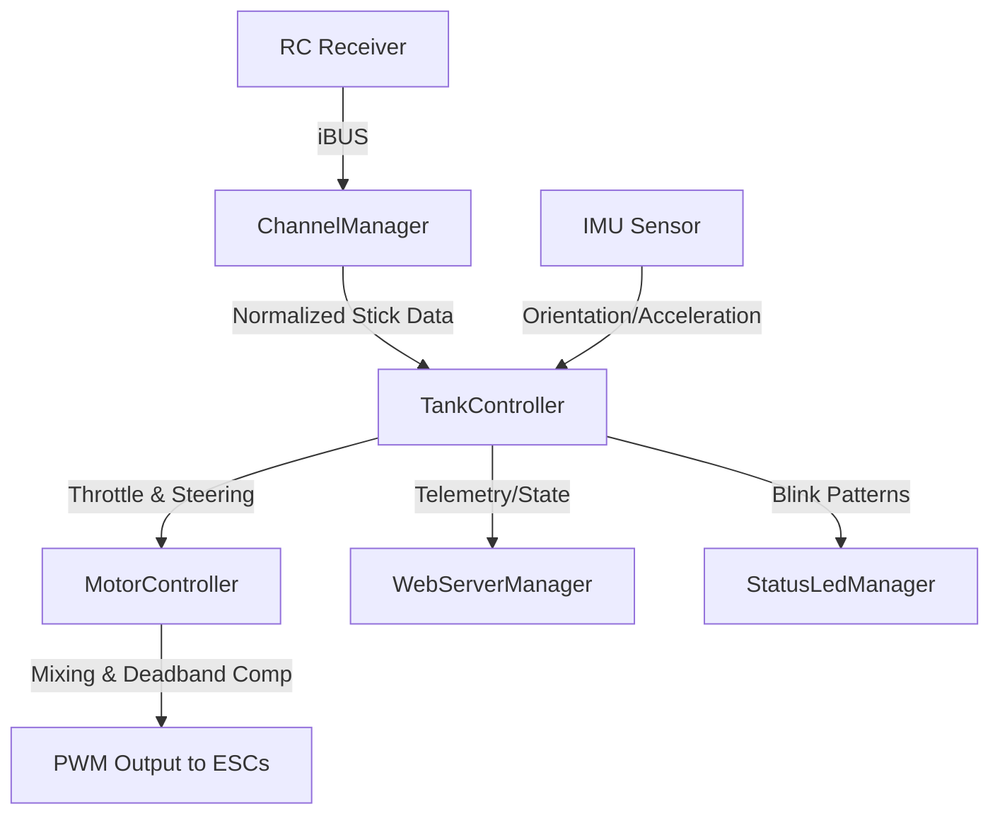

# ESP32 Rover / Tank Robot Controller - Context for AI Agents

## Project Overview

This is an ESP32-based control system for a differential drive (tank-style) robot. It receives commands via the iBUS protocol (typically from an RC receiver), processes differential mixing (throttle + steering), and controls two Electronic Speed Controllers (ESCs) for the left and right motors.

### Key Characteristics
- **Platform**: ESP32
- **Concurrency**: Dual-core operation using FreeRTOS tasks
- **Communication**: iBUS protocol (10 channels)
- **Control**: Differential tank drive (throttle + steering mixing)
- **Motor Output**: 2 ESCs with deadband compensation and arming sequence
- **Telemetry & Monitoring**: Integrated IMU sensor and Web Server
- **Architecture**: Modular, Object-Oriented, State Machine-based

## Project Structure

```text
src/
├── main.cpp                      # Main entry point (FreeRTOS tasks setup)
├── config/
│   ├── config.h                  # System configuration (timeouts, PWM, loops)
│   └── pins.h                    # ESP32 pin mappings
├── types/
│   ├── types.h                   # Shared data structures and enums
│   └── types.cpp                 # Implementations for types/constructors
├── utils/
│   ├── status_led_manager.h/cpp  # Manages the status LED blink patterns
│   └── utils.h/cpp               # Math utilities and normalizations
├── controllers/
│   ├── tank_controller.h/cpp     # Main controller/coordinator of the system
│   └── motor_controller.h/cpp    # Specific controller for ESCs and mixing
├── communication/
│   └── channel_manager.h/cpp     # iBUS communication management
├── sensors/
│   └── imu_sensor.h/cpp          # Interfacing with the IMU sensor
├── web/
│   └── web_server_manager.h/cpp  # Web server for telemetry and diagnostics
└── debug/
    └── debug_manager.h/cpp       # Debugging and logging system
```

## Main Data Flow



## Concurrency and Multitasking

The ESP32 utilizes FreeRTOS to divide the workload across its two cores:

1. **`tankControlTask` (Core 1)**: Real-time control loop. Handles iBUS reading, IMU processing, differential mixing, state machine updates, and motor output generation. Needs strict timing (e.g., 50Hz) and must use `vTaskDelay` to yield to the watchdog.
2. **`webServerTask` (Core 0)**: Asynchronous web server operations. Serves web pages and handles potential incoming requests without blocking the critical control loop.

## Core Classes & Responsibilities

### TankController
- **Role**: General system coordination and state machine execution.
- **States**: `INITIALIZING`, `ARMING`, `ARMED`, `TIMEOUT`, `ERROR`.
- **Key Methods**:
  - `initialize()`: Sets up all sub-systems.
  - `update()`: Main non-blocking loop called by `tankControlTask`.

### ChannelManager  
- **Role**: iBUS communication and data validation.
- **Features**: Reads 10 iBUS channels, normalizes values to a standard range (-1.0 to 1.0), detects connection timeouts, and validates data integrity.

### MotorController
- **Role**: ESC control and differential mixing.
- **Features**: 
  - Tank mixing: `left = throttle + steering`, `right = throttle - steering`.
  - Normalization: Prevents command saturation.
  - Deadband compensation.
  - Arming sequence enforcement.

### WebServerManager
- **Role**: Exposes telemetry and system status over WiFi.
- **Features**: Hosts diagnostic pages, reads current `SystemState`, sensor data, and motor commands.

### ImuSensor
- **Role**: Handles acceleration and gyroscope reading.
- **Features**: Updates `ImuData` to be used for stabilization, telemetry, or future autonomous operations.

### StatusLedManager
- **Role**: Visual feedback using the built-in LED.
- **Features**: Different blink rates depending on the `SystemState` (e.g., solid for ARMED, fast blink for ERROR).

### DebugManager
- **Role**: Controlled debug output.
- **Features**: Timed console printing to avoid flooding the Serial monitor.

## Important Algorithms

### Stick Normalization
Converts standard RC PWM signals (usually 1000µs - 2000µs) to a floating-point range of `-1.0` to `1.0`. Applies a deadzone around the neutral center (1500µs) to eliminate stick jitter.

### Differential (Tank) Mixing
```cpp
left_motor_cmd = throttle + steering
right_motor_cmd = throttle - steering
```
Values are clamped or normalized proportionally if any side exceeds the maximum ±1.0 range, ensuring the robot maintains its turning radius even at full throttle.

### ESC Deadband Compensation
Many bidirectional ESCs have a large deadband around neutral (e.g., 1482µs to 1582µs) where the motor does not spin. The algorithm maps the idealized `-1.0` to `1.0` output directly to the active regions:
- Negative (Reverse): `1000µs` to `1481µs`
- Positive (Forward): `1583µs` to `2000µs`
This creates a linear, responsive feel from the sticks despite the ESC hardware deadband.

## Configurations & Constants

### PWM and ESC Constraints
- `PWM_MIN = 1000` (Standard min PWM)
- `PWM_MAX = 2000` (Standard max PWM)
- `PWM_MID = 1500` (Neutral center)
- `ESC_DEAD_LOW = 1482` (Deadband start)
- `ESC_DEAD_HIGH = 1582` (Deadband end)

### Timing & Timeouts
- `CONTROL_INTERVAL_MS = 20` (Main loop at 50Hz)
- `DEBUG_INTERVAL_MS = 100` (Debug output at 10Hz)
- `IBUS_TIMEOUT_MS = 400` (Signal loss timeout)
- `ARMING_TIME_MS = 1500` (Time required to hold neutral to arm ESCs)

## Code Conventions & Rules

### Naming
- **Classes**: PascalCase (`TankController`)
- **Methods/Variables**: camelCase (`updateSystem`)
- **Constants/Macros**: UPPER_SNAKE_CASE (`PWM_MIN`)
- **Namespaces**: PascalCase (`Config`, `Utils`)

### Organization
- Include guards `#pragma once` are strictly used in headers.
- Implementations are separated into `.cpp` files.
- Configuration and hardware mapping are centralized in `config/config.h` and `config/pins.h`.

### Performance & Safety
- **Watchdog Timer**: Always use `vTaskDelay()` or `yield()` in long loops and FreeRTOS tasks.
- **No Blocking Code**: Avoid `delay()` in the main control loops. Use `millis()` based state-machine timers.
- **Fail-Safe**: The system MUST enter `TIMEOUT` state and output neutral PWM if the iBUS signal is lost for >400ms.
- **Arming**: ESCs must be armed with a neutral signal for a specified duration before movement is allowed.

## Design Patterns

1. **Dependency Injection**: Controllers receive their dependencies (e.g., `TankController` orchestrates but leaves specific motor logic to `MotorController`).
2. **State Machine**: The system strictly follows `SystemState` (INITIALIZING -> ARMING -> ARMED / TIMEOUT / ERROR).
3. **Facade Pattern**: `TankController` hides the complexity of interacting with sensors, communication, and motors from the main FreeRTOS loop.
4. **Concurrency / Task-based**: Separation of concerns using FreeRTOS tasks mapped to specific cores.
5. **Strategy / Adapter (Implicit)**: Utility functions adapt raw PWM to float semantics and back.

## Notes for AI Agents
- **Extensibility**: When adding new sensors, define them in `types/types.h` under `SensorData`, create the sensor class, and integrate it into `TankController::update()`.
- **System Stability**: The dual-core FreeRTOS setup is sensitive to watchdog starvation. Ensure `vTaskDelay` is properly configured in any new task you create.
- **Prioritize Safety**: Never bypass the iBUS timeout or ESC arming checks. A runaway heavy robot is dangerous.
